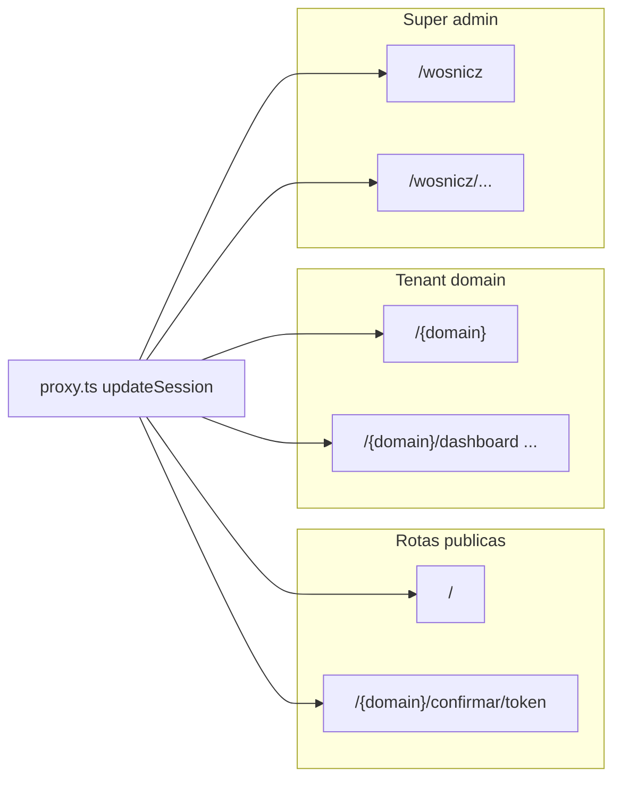

# Documentação completa — CRM Odontológico

Documento gerado a partir do código-fonte do repositório e complementado com uma leitura somente leitura do projeto Supabase ligado ao ambiente Cursor (tabelas e migrações). **Contagens de linhas nas tabelas** são um snapshot pontual e mudam com o uso.

---

## 1. Resumo executivo

Aplicação **multi-tenant** para gestão de clínicas odontológicas: **leads** (pipeline Kanban), **agenda** (consultas, salas, procedimentos), **confirmação de consultas** por link público, **mensagens WhatsApp** integradas via **Evolution API**, e um painel administrativo global (**Wosnicz**) para super administradores criarem e gerenciarem clínicas.

### Perfis de usuário (`UserRole`)

| Valor            | Descrição resumida |
|------------------|--------------------|
| `operator`       | Operador da clínica (acesso ao CRM no domínio da empresa). |
| `admin`          | Administrador da clínica (inclui **Configurações** na navegação). |
| `super_admin`    | Acesso ao painel `/wosnicz` e a qualquer domínio de tenant (guard específico no layout). |

### Tenancy

Cada clínica é identificada pelo campo `companies.domain` (slug na URL). O usuário acessa `/{domain}` para login e `/{domain}/dashboard`, `/{domain}/leads`, etc.

---

## 2. Stack técnica

| Camada        | Tecnologia |
|---------------|------------|
| Framework     | **Next.js 16.2.3** (App Router) |
| UI            | **React 19.2.4**, **Tailwind CSS 4** |
| Backend dados | **Supabase** (`@supabase/supabase-js`, `@supabase/ssr`) |
| Drag-and-drop | **@dnd-kit** (Kanban) |
| Utilitários   | `server-only` (marcadores de módulos servidor) |

Arquivos de referência: `package.json`, `next.config.ts`.

---

## 3. Como executar

### Pré-requisitos

- Node.js compatível com Next.js 16 (versão LTS recomendada).
- Projeto Supabase configurado com o mesmo esquema esperado pelo app (ver secção [Supabase](#8-supabase-postgres--contrato-do-app)).
- (Opcional para WhatsApp) Evolution API acessível e variáveis configuradas.

### Comandos NPM

```bash
npm install
npm run dev      # servidor de desenvolvimento (http://localhost:3000)
npm run build    # build de produção
npm run start    # servidor após build
npm run lint     # ESLint (eslint-config-next)
```

**Não existem** scripts `test`, `e2e` ou dependências de Vitest/Jest/Playwright no `package.json`.

### Navegação típica

- **`/`** — landing genérica; orienta acesso por URL da clínica.
- **`/{domain}`** — tela de login (`LoginForm`) para aquele tenant.
- **`/{domain}/dashboard`**, **`/leads`**, **`/conversas`**, **`/agenda`**, **`/settings`** — app CRM (prefixo `/{domain}`).
- **`/{domain}/confirmar/{token}`** — página pública de confirmação/reagendamento de consulta (sem exigir login no fluxo normal).
- **`/wosnicz`** — login do painel master.
- **`/wosnicz/dashboard`**, **`/wosnicz/clinicas`**, etc. — restrito a `super_admin`.

---

## 4. Variáveis de ambiente

| Variável | Uso | Onde aparece (referência) |
|----------|-----|---------------------------|
| `NEXT_PUBLIC_SUPABASE_URL` | URL do projeto Supabase | `src/lib/supabase/client.ts`, `server.ts`, `middleware.ts` |
| `NEXT_PUBLIC_SUPABASE_ANON_KEY` | Chave anônima (browser + servidor com cookies) | Mesmos arquivos |
| `SUPABASE_SERVICE_ROLE_KEY` | Cliente admin (bypass RLS); **somente servidor** | `src/lib/supabase/admin.ts`, rotas API que precisam escrita privilegiada |
| `EVOLUTION_API_URL` | Base URL da Evolution API | `src/lib/evolution/client.ts` |
| `EVOLUTION_API_KEY` | Chave global da Evolution; validação do webhook | `src/lib/evolution/client.ts`, `src/app/api/whatsapp/webhook/[instance]/route.ts` |
| `EVOLUTION_WEBHOOK_BASE_URL` | URL pública do app para registrar webhook na Evolution | `src/app/api/whatsapp/instance/connect/route.ts`, `sync/route.ts` |
| `NEXT_PUBLIC_PUBLIC_APP_URL` | URL HTTPS pública (links de confirmação, etc.) | `src/components/agenda/appointment-actions.tsx` |

**Notas:**

- Sem `NEXT_PUBLIC_SUPABASE_*`, o app não autentica nem consulta dados.
- Sem `SUPABASE_SERVICE_ROLE_KEY`, operações que usam `createAdminClient()` falham com erro explícito em `admin.ts`.
- Evolution: se não configurada, `evolution.isConfigured()` faz rotas dependentes retornarem erro (ex.: carregar histórico).

---

## 5. Arquitetura de rotas e proxy

O Next.js 16 utiliza **`src/proxy.ts`** com matcher que cobre quase todas as rotas, chamando `updateSession` de `src/lib/supabase/middleware.ts`:

- **Sessão Supabase** é atualizada/refresada por request (cookies `sb-*`).
- **`/api/*` não** passa por redirects de tenant — evita quebrar webhooks e chamadas sem cookie (comentário explícito no código).
- Para paths **`/{domain}/...`**: rotas protegidas (exceto `confirmar`) exigem usuário logado; se já logado em `/{domain}`, redireciona para `/{domain}/dashboard`.
- **`/wosnicz/*`** protegido exige usuário; não logado redireciona para `/wosnicz`.

Validação fina de **tenant** (usuário só no próprio domínio; `super_admin` liberado) está em `src/app/[domain]/layout.tsx`. O painel Wosnicz valida `super_admin` em `src/app/wosnicz/(app)/layout.tsx`.



---

## 6. API Routes (`src/app/api`)

Todas as rotas abaixo são **Route Handlers** do App Router. Prefixo URL = caminho do arquivo sem `route.ts`.

| Caminho | Método | Autenticação / autorização | Responsabilidade |
|---------|--------|----------------------------|------------------|
| `analytics/dashboard` | GET | Sessão Supabase (`getAuthSession`); 401 se sem usuário | KPIs agregados; query `companyId`, `period` (`today`, `7d`, `30d`, `month`). Implementação em `dashboard-data.ts`. |
| `operators/create` | POST | `requireAdminForDomain(domain)` | Cria operador na clínica. |
| `operators/delete` | POST | `requireAdminForDomain(domain)` | Remove/desativa operador. |
| `wosnicz/create-clinic` | POST | `requireSuperAdmin()` | Cria empresa + admin inicial etc. |
| `wosnicz/delete-clinic` | POST | `requireSuperAdmin()` | Remove clínica (fluxo perigoso). |
| `wosnicz/toggle-clinic` | POST | `requireSuperAdmin()` | Ativa/desativa clínica. |
| `whatsapp/instance/connect` | POST | `requireAdminForDomain(domain)` | Conecta instância Evolution, webhook. |
| `whatsapp/instance/disconnect` | POST | `requireAdminForDomain(domain)` | Desconecta instância. |
| `whatsapp/instance/sync` | POST | `requireAdminForDomain(domain)` | Sincroniza estado com Evolution. |
| `whatsapp/instance/status` | GET | `createClient` + `auth.getUser()`; valida pertença ao `domain` | Status da instância para UI. |
| `whatsapp/messages/send` | POST | Usuário logado + perfil em `users` | Envia mensagem via Evolution e persiste. |
| `whatsapp/messages/load-history` | POST | Usuário logado + chat da mesma `company_id` | Busca histórico na Evolution e reconcilia com DB. |
| `whatsapp/webhook/[instance]` | POST | **Sem sessão**; valida `apikey` header ou body contra `EVOLUTION_API_KEY` e/ou token da instância | Recebe eventos Evolution (mensagens, status). |

---

## 7. Camada Supabase no código (`src/lib/supabase`)

| Arquivo | Função |
|---------|--------|
| `client.ts` | Cliente browser (`createBrowserClient`). |
| `server.ts` | Cliente servidor com cookies (`createServerClient`). |
| `middleware.ts` | Lógica usada por `proxy.ts` para sessão e redirects. |
| `admin.ts` | Cliente com **service role** — usar só em servidor/API. |
| `cookie-options.ts` | Opções de cookies da sessão. |
| `cached-data.ts` | `getAuthSession`, `getDomainCompany` com `React.cache` para deduplicar por request. |
| `require-admin-for-domain.ts` | Garante admin da clínica para APIs que recebem `domain`. |
| `require-super-admin.ts` | Garante `super_admin`. |
| `verify-credentials.ts` | Verificação de URL/keys públicas. |
| `dashboard-data.ts` | Queries/RPCs de analytics. |
| `agenda-data.ts` | Dados da agenda. |

Tipagem do banco: `src/lib/types/database.ts`.

---

## 8. Supabase (Postgres + contrato do app)

### 8.1 Fontes de verdade

- **Contrato TypeScript** (tabelas, views, funções expostas ao cliente tipado): `src/lib/types/database.ts`.
- **Estado remoto** consultado via MCP Supabase no momento da documentação: projeto **`dbktvsujkhrbijxsxxni`** (“DataBase \| CRM \| ClinicasOdontologicas”). Se o seu ambiente usar outro projeto, compare IDs no dashboard Supabase.

Este repositório **não contém** pasta `supabase/migrations` versionada; o histórico de migrações aplicadas está **no projeto Supabase remoto**.

### 8.2 Tabelas `public` (contrato + RLS)

Segundo o tipo `Database["public"]["Tables"]` e conferência remota (Todas com **RLS ativo** no projeto consultado):

| Tabela | Propósito resumido |
|--------|---------------------|
| `companies` | Clínicas / tenants (`domain`, dados cadastrais, `settings`). |
| `users` | Usuários do CRM ligados a `auth.users` via `auth_id`. |
| `pipeline_stages` | Estágios do funil Kanban por empresa. |
| `user_pipeline_stage_order` | Ordem personalizada de colunas por usuário. |
| `leads` | Pacientes/leads. |
| `lead_sources` | Origens de lead. |
| `specialties` | Especialidades odontológicas. |
| `activities` | Timeline (notas, chamadas, WhatsApp, etc.). |
| `tags` / `lead_tags` | Tags em leads. |
| `custom_fields` / `custom_field_values` | Campos customizados. |
| `rooms` | Salas de atendimento. |
| `procedure_types` | Tipos de procedimento e duração padrão. |
| `appointments` | Agendamentos (`status`, `visibility`, etc.). |
| `clinic_hours` | Horário de funcionamento por dia da semana. |
| `clinic_holidays` | Feriados. |
| `agenda_blocks` | Bloqueios de agenda. |
| `appointment_confirmations` | Tokens de confirmação pública. |
| `message_templates` | Templates de mensagem (confirmação, lembrete, etc.). |
| `user_role_tags` / `user_role_tag_assignments` | Tags de papel / visibilidade na agenda. |
| `whatsapp_instances` | Instância Evolution por empresa. |
| `whatsapp_chats` | Conversas (JID, preview, vínculo opcional com lead). |
| `whatsapp_messages` | Mensagens armazenadas. |

### 8.3 Views (`Database["public"]["Views"]`)

| View | Descrição |
|------|-----------|
| `vw_lead_funnel` | Agregados para funil por status. |
| `vw_leads_detailed` | Lead com nomes de estágio, especialidade, responsável, etc. |
| `vw_activities_detailed` | Atividade com nomes de usuário e lead. |

### 8.4 Funções RPC (`Database["public"]["Functions"]`)

Funções tipadas para chamada via `supabase.rpc`:

| Função | Args principais (resumo) | Retorno / uso |
|--------|--------------------------|---------------|
| `resolve_login` | `p_domain`, `p_extension_number` | Resolve e-mail de login para Auth. |
| `create_user` | dados do novo usuário | UUID string |
| `change_user_password` | `p_user_id`, `p_new_password` | void |
| `deactivate_user` / `reactivate_user` | `p_user_id` | void |
| `seed_company_defaults` | `p_company_id` | void |
| `find_lead_by_phone` | `p_company_id`, `p_phone` | UUID ou null |
| `apply_kanban_move` | lead, status legado, ordens | void (legado) |
| `apply_kanban_move_v2` | lead, estágios, ordens, especialidade, motivo perda | void |
| `reorder_pipeline_stages` | `p_ordered_ids` | void |
| `check_appointment_conflict` | dentista, sala, intervalo | boolean |
| `check_appointment_availability` | empresa, dentista, sala, intervalo | motivo ou null |
| `get_dentist_availability` | `p_company_id`, `p_date` | linhas de disponibilidade |
| `confirmation_lookup` | `p_domain`, `p_token` | dados para UI pública |
| `confirmation_respond` | domínio, token, ação | string |
| `get_dashboard_analytics` | empresa, intervalo de datas | `DashboardAnalytics` |
| `get_stage_funnel` | empresa, intervalo | linhas de funil |

### 8.5 Enums Postgres mapeados (`Database["public"]["Enums"]`)

- `user_role` → `UserRole`
- `lead_status` → `LeadStatus`
- `activity_type` → `ActivityType`
- `custom_field_type` → `CustomFieldType`

Outros unions TypeScript no mesmo arquivo cobrem status de agendamento, WhatsApp, confirmações, etc.

### 8.6 Estado remoto (MCP) — snapshot

**Projeto:** `dbktvsujkhrbijxsxxni`  
**Contagens de linhas** (snapshot; apenas referência operacional):

companies: 3 · users: 5 · lead_sources: 25 · leads: 9 · custom_fields: 15 · custom_field_values: 5 · activities: 30 · tags: 18 · lead_tags: 6 · pipeline_stages: 29 · specialties: 24 · rooms: 11 · procedure_types: 29 · appointments: 4 · user_pipeline_stage_order: 1 · clinic_hours: 21 · clinic_holidays: 0 · agenda_blocks: 0 · appointment_confirmations: 2 · message_templates: 0 · user_role_tags: 12 · user_role_tag_assignments: 1 · whatsapp_instances: 1 · whatsapp_chats: 403 · whatsapp_messages: 151

**Migrações aplicadas** (nomes oficiais no histórico Supabase):

`perf_optimize_rls_and_indexes`, `leads_kanban_position`, `apply_kanban_move_rpc`, `pipeline_stages_and_specialties`, `apply_kanban_move_v2_rpc`, `lead_default_stage_trigger`, `leads_clinical_fields`, `storage_bucket_patient_photos`, `agenda_schema`, `financeiro_schema`, `remove_financeiro_and_convenio`, `reorder_pipeline_stages_rpc`, `user_pipeline_stage_order_table`, `reorder_pipeline_stages_per_user`, `agenda_clinic_hours_holidays_blocks`, `agenda_confirmations_and_templates`, `agenda_conflict_includes_blocks`, `agenda_seed_default_clinic_hours`, `user_role_tags_and_assignments`, `user_role_tags_seed_and_backfill`, `whatsapp_chat_schema`, `add_activities_to_realtime`, `fn_get_dashboard_analytics`, `fn_get_stage_funnel`, `appointments_visibility_columns`, `fn_check_appointment_availability`, `fn_get_dentist_availability`

**Infere-se das migrações (não duplicado em tipos TS):**

- Bucket de **Storage** para fotos de pacientes (`storage_bucket_patient_photos`).
- **Realtime** habilitado ou publicado para `activities` (`add_activities_to_realtime`).
- Módulo financeiro foi criado e **removido** do escopo (`financeiro_schema` / `remove_financeiro_and_convenio`).

Para políticas RLS linha a linha, triggers e índices, use o **SQL Editor** ou documentação gerada no Dashboard Supabase.

---

## 9. Integração WhatsApp (Evolution API)

| Componente | Arquivo |
|------------|---------|
| Cliente HTTP Evolution | `src/lib/evolution/client.ts` |
| Normalização telefone ↔ JID | `src/lib/evolution/phone.ts` |
| Envio a partir do cliente (quando aplicável) | `src/lib/whatsapp/send-from-client.ts` |
| Webhook | `src/app/api/whatsapp/webhook/[instance]/route.ts` |
| UI instância | `src/components/settings/whatsapp-instance-manager.tsx` |
| UI conversas | `src/app/[domain]/conversas/conversas-content.tsx` |

Fluxo resumido: admin conecta instância → Evolution envia eventos para o webhook → mensagens e chats persistidos em `whatsapp_*` → operadores visualizam em **Conversas** e enviam via API `messages/send`.

---

## 10. Componentes de UI (`src/components`)

Organização por pasta:

| Pasta | Conteúdo típico |
|-------|-------------------|
| `layout/` | `AppShell`, `Sidebar`, `SessionProvider` |
| `dashboard/` | Kanban, funil, KPIs, modais de estágio/perda |
| `leads/` | Tabela, formulário, timeline, tags, cabeçalho |
| `agenda/` | Grade mensal, disponibilidade, modal de consulta, ações (links públicos) |
| `settings/` | Gestores de pipeline, salas, horários, feriados, operadores, WhatsApp, templates, campos customizados, etc. |
| `wosnicz/` | Login master, tabela de clínicas, formulário nova clínica, usuários, zona perigosa |
| `ui/` | Primitivos (botão, input, card, select, textarea, badge) |

---

## 11. Testes, lint e CI/CD

| Área | Situação atual |
|------|----------------|
| Testes automatizados | **Ausentes** — sem arquivos `*.test.*` / `*.spec.*` e sem runner configurado no `package.json`. |
| Lint | **ESLint** com `eslint-config-next`. |
| CI/CD | **Sem** workflows em `.github/workflows` no repositório; deploy não está documentado no código. |

Recomendações futuras (fora do escopo deste arquivo): testes de contrato nas RPCs críticas, testes E2E no fluxo login + Kanban, pipeline CI com `lint` + `build`.

---

## 12. Documentação auxiliar no repositório

- **`CONTEXT-SESSAO-WHATSAPP-CRM.md`** — notas de contexto de sessão sobre WhatsApp/CRM (útil para onboarding da equipe).
- **`README.md`** — template padrão do create-next-app; não descreve o domínio do produto.

---

## 13. Referência rápida de pastas

```
src/
  app/
    [domain]/          # UI tenant + login
    wosnicz/           # Painel super_admin
    api/               # Route handlers REST
  components/          # UI reutilizável
  lib/
    supabase/          # Clientes e helpers
    evolution/         # Integração WhatsApp
    types/database.ts  # Tipos gerados/manualmente alinhados ao DB
  proxy.ts             # Proxy Next 16 (sessão Supabase)
```

---

*Fim da documentação.*
